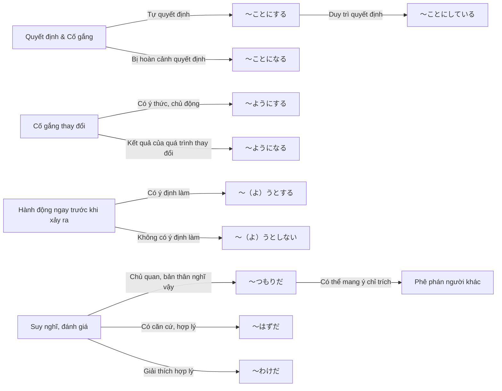
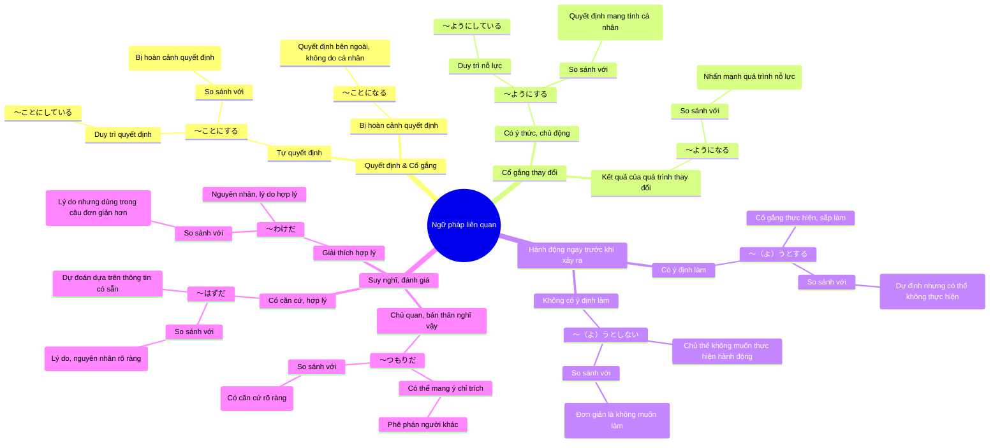

# Giải thích chi tiết về các mẫu ngữ pháp:

#### **1. ～ことにする・～ことにしている**
✅ **Ý nghĩa:**
- **～ことにする**: Quyết định làm gì đó (thể hiện quyết định cá nhân).
- **～ことにしている**: Quyết định làm gì đó và đang duy trì quyết định đó (thói quen hoặc quy tắc cá nhân).

✅ **Cách dùng:**
| Cấu trúc | Ý nghĩa |
|----------|---------|
| ［動］辞書形/ている/ない形 ＋ **ことにする** | Quyết định sẽ làm gì (thường là quyết định cá nhân, có thể ngay tại thời điểm nói). |
| ［動］辞書形/ない形 ＋ **ことにしている** | Quyết định làm gì đó từ trước và vẫn đang duy trì (thói quen, nguyên tắc cá nhân). |

✅ **Ví dụ:**
1. **冷蔵庫が壊れたので、新しいのを買うことにした。**  
*(Vì tủ lạnh bị hỏng nên tôi quyết định mua cái mới.)*  
→ **Dạng ～ことにした, thể hiện quyết định tại một thời điểm nhất định.*

2. **口を出すと怒られるので、何も言わないで黙っていることにした。**  
*(Nếu lên tiếng thì sẽ bị mắng, nên tôi quyết định im lặng.)*

3. **（Hội thoại）**  
   - Con gái: お父さん、今度の休みにディズニーランドに連れていってよ。  
     *(Bố ơi, kỳ nghỉ này đưa con đi Disneyland đi!)*  
   - Bố: よし、わかった。じゃ、友達とゴルフに行く約束は断ることにするよ。  
     *(Được rồi. Vậy thì bố sẽ hủy cuộc hẹn đi chơi golf với bạn bè.)*  
→ **Quyết định ngay tại thời điểm nói.**

4. **部長の言葉はいつもとても厳しいが、わたしは気にしないことにしている。**  
*(Lời nói của trưởng phòng lúc nào cũng nghiêm khắc, nhưng tôi quyết định không để tâm đến.)*  
→ **Hành động duy trì như một nguyên tắc cá nhân.**

---

#### **2. ～ようにする・～ようにしている**
✅ **Ý nghĩa:**
- **～ようにする**: Cố gắng làm gì đó (ý chí bản thân).
- **～ようにしている**: Cố gắng làm gì đó một cách liên tục (thói quen, nỗ lực duy trì).

✅ **Cách dùng:**
| Cấu trúc | Ý nghĩa |
|----------|---------|
| ［動］辞書形/ない形 ＋ **ようにする** | Cố gắng làm hoặc không làm gì. |
| ［動］辞書形/ない形 ＋ **ようにしている** | Duy trì việc cố gắng làm hoặc không làm gì. |

✅ **Ví dụ:**
1. **水や電気は大切に使うようにしましょう。**  
*(Chúng ta hãy cố gắng sử dụng nước và điện tiết kiệm.)*

2. **（Hội thoại）**  
   - Vợ: あなたの帰りが毎日遅いから、子どもたちが寂しがっているわ。  
     *(Anh về nhà muộn mỗi ngày, bọn trẻ cảm thấy cô đơn đấy!)*  
   - Chồng: そうか。これからはもっと早く帰るようにするよ。  
     *(Vậy à. Từ giờ anh sẽ cố gắng về sớm hơn.)*

3. **集合時間に遅れないようにしてください。**  
*(Hãy cố gắng không đến muộn giờ tập trung.)*

4. **私はなるべく自分で料理を作って食べるようにしている。**  
*(Tôi cố gắng tự nấu ăn và ăn càng nhiều càng tốt.)*  
→ **Duy trì như một thói quen.**

---

#### **3. ～（よ）うとする**
✅ **Ý nghĩa:**
- Cố gắng làm gì đó.
- Hành động ngay trước khi xảy ra.
- Khi ở thể phủ định, diễn tả sự từ chối hoặc không có ý định làm gì.

✅ **Cách dùng:**
| Cấu trúc | Ý nghĩa |
|----------|---------|
| ［動］う・よう形 ＋ **とする** | Cố gắng làm gì, định làm gì. |
| ［動］う・よう形 ＋ **としない** | Không có ý định làm gì (chủ ngữ không phải người nói). |

✅ **Ví dụ:**
1. **あの子は一生けんめい手を伸ばして、テーブルの上のおもちゃを取ろうとしている。**  
*(Đứa bé đó đang cố gắng vươn tay lấy món đồ chơi trên bàn.)*

2. **きのうの夜は眠ろうとしてもなかなか眠れなかった。**  
*(Tối qua dù cố gắng ngủ nhưng mãi không ngủ được.)*

3. **家を出ようとしたとき、突然大雨が降り出した。**  
*(Ngay khi định ra khỏi nhà thì trời bất ngờ đổ mưa to.)*

4. **重い荷物を持ち上げようとしたら、腰が痛くなってしまった。**  
*(Tôi vừa định nhấc cái túi nặng thì bị đau lưng.)*

5. **いくら進めても夫は病院へ行こうとしない。**  
*(Dù tôi có khuyên thế nào, chồng tôi cũng không chịu đi bệnh viện.)*

6. **父に事情を説明しようとしたが、父は話を聞こうとはしなかった。**  
*(Tôi đã định giải thích tình hình cho bố, nhưng bố không chịu nghe.)*

---

#### **4. ～つもりだ**
✅ **Ý nghĩa:**
- **Bản thân nghĩ là như vậy, nhưng thực tế không phải vậy.**
- **Cũng có thể mang sắc thái chỉ trích, phê phán.**

✅ **Cách dùng:**
| Cấu trúc | Ý nghĩa |
|----------|---------|
| 普通形（な形だ - な・［名］だ - の）＋ **つもりだ** | Nghĩ rằng là như vậy, nhưng thực tế có thể không đúng. |

✅ **Ví dụ:**
1. **私は今年77歳ですが、まだまだ若いつもりです。**  
*(Tôi năm nay 77 tuổi, nhưng vẫn nghĩ là mình còn trẻ.)*  
→ **Bản thân nghĩ vậy, nhưng thực tế không phải thế.**

2. **冗談で言ったつもりの言葉だったが、彼は怒ったような顔をした。**  
*(Tôi nghĩ rằng mình chỉ nói đùa, nhưng anh ấy có vẻ giận.)*

3. **先に入社した由美は先輩のつもりらしいが、本当は私の方が年上なのだ。**  
*(Yumi vào công ty trước nên nghĩ rằng mình là tiền bối, nhưng thực ra tôi lớn tuổi hơn.)*  
→ **Có ý phê phán nhẹ.**

4. **こんなに汚いのに、それでも掃除したつもりですか。**  
*(Bẩn thế này mà vẫn nghĩ là đã dọn dẹp à?)*  
→ **Câu mang ý trách móc, phê phán.**

---

💡 **Tóm lại:**
- **～ことにする / ～ことにしている** → **Quyết định (một lần/duy trì).**
- **～ようにする / ～ようにしている** → **Cố gắng (một lần/duy trì).**
- **～（よ）うとする** → **Cố làm gì, sắp làm gì, không có ý định làm gì.**
- **～つもりだ** → **Nghĩ rằng như vậy nhưng thực tế khác.**

# 📌 **So sánh chi tiết từng mẫu với các mẫu ngữ pháp tương tự**

---

## **1. ～ことにする vs. ～ことになる**
| Mẫu ngữ pháp | Ý nghĩa | Chủ thể quyết định |
|-------------|---------|------------------|
| **～ことにする** | **Tự mình quyết định** làm gì đó | **Chủ thể (người nói) tự quyết định** |
| **～ことになる** | **Một quyết định được đưa ra** (không phải do chủ thể tự quyết định) | **Quyết định của tập thể, hoàn cảnh, người khác** |

✅ **Ví dụ so sánh:**
1. **日本へ留学することにしました。**  
*(Tôi đã quyết định đi du học Nhật Bản.)* → **Tự quyết định.**  
2. **会社の方針で、日本へ留学することになりました。**  
*(Theo chính sách công ty, tôi phải đi du học Nhật Bản.)* → **Không phải do mình quyết định.**

💡 **Tóm lại:**  
- **～ことにする**: Quyết định do cá nhân tự đưa ra.  
- **～ことになる**: Quyết định do yếu tố bên ngoài tác động.  

---

## **2. ～ようにする vs. ～ようになる**
| Mẫu ngữ pháp | Ý nghĩa | Chủ thể hành động |
|-------------|---------|------------------|
| **～ようにする** | **Cố gắng** làm gì đó để thay đổi hành vi, thói quen | **Người nói chủ động cố gắng** |
| **～ようになる** | **Biểu thị sự thay đổi** (khả năng, thói quen) theo thời gian | **Sự thay đổi tự nhiên, không nhất thiết có sự cố gắng của người nói** |

✅ **Ví dụ so sánh:**
1. **健康のために、毎朝ジョギングするようにしている。**  
*(Vì sức khỏe, tôi cố gắng chạy bộ mỗi sáng.)* → **Chủ động cố gắng.**  
2. **毎朝ジョギングするようになった。**  
*(Dạo gần đây, tôi đã bắt đầu có thói quen chạy bộ mỗi sáng.)* → **Thay đổi một cách tự nhiên, không nhấn mạnh sự cố gắng.**  

💡 **Tóm lại:**  
- **～ようにする**: Nhấn mạnh sự nỗ lực, cố gắng để làm gì đó.  
- **～ようになる**: Nhấn mạnh kết quả thay đổi, không quan trọng có cố gắng hay không.  

---

## **3. ～（よ）うとする vs. ～（よ）うとしない**
| Mẫu ngữ pháp | Ý nghĩa | Ý chí chủ thể |
|-------------|---------|------------------|
| **～（よ）うとする** | **Cố gắng, định làm gì đó** hoặc **hành động ngay trước khi xảy ra** | **Có ý chí làm gì đó** |
| **～（よ）うとしない** | **Không có ý định làm gì đó** (chủ ngữ thường là người khác) | **Không có ý chí thực hiện** |

✅ **Ví dụ so sánh:**
1. **彼は何か言おうとしたが、結局何も言わなかった。**  
*(Anh ấy định nói gì đó, nhưng cuối cùng không nói gì.)* → **Định làm nhưng không làm.**  
2. **何度頼んでも、彼は仕事をしようとしない。**  
*(Dù tôi nhờ bao nhiêu lần, anh ta vẫn không chịu làm việc.)* → **Không có ý định làm.**

💡 **Tóm lại:**  
- **～（よ）うとする**: Thể hiện cố gắng hoặc chuẩn bị thực hiện một hành động.  
- **～（よ）うとしない**: Thể hiện sự từ chối hoặc không có ý định làm hành động đó.  

---

## **4. ～つもりだ vs. ～はずだ vs. ～わけだ**
| Mẫu ngữ pháp | Ý nghĩa | Tính chắc chắn |
|-------------|---------|------------------|
| **～つもりだ** | **Mình nghĩ là như vậy, nhưng thực tế có thể khác** | **Không chắc chắn, chủ quan** |
| **～はずだ** | **Chắc chắn là vậy (dựa vào lý do, logic)** | **Có căn cứ, khách quan hơn** |
| **～わけだ** | **Giải thích lý do, kết luận hợp lý** | **Dựa trên sự thật, dẫn đến kết luận** |

✅ **Ví dụ so sánh:**
1. **私はまだ若いつもりだ。**  
*(Tôi nghĩ rằng mình vẫn còn trẻ.)* → **Suy nghĩ chủ quan, thực tế có thể khác.**  
2. **彼は5年間日本に住んでいたから、日本語が上手なはずだ。**  
*(Anh ấy đã sống ở Nhật 5 năm rồi nên chắc chắn tiếng Nhật giỏi.)* → **Có căn cứ logic.**  
3. **彼は毎日ジムに行っているから、筋肉があるわけだ。**  
*(Anh ấy đi tập gym mỗi ngày nên có cơ bắp là chuyện đương nhiên.)* → **Giải thích hợp lý.**

💡 **Tóm lại:**  
- **～つもりだ**: Chủ quan, chỉ là suy nghĩ của bản thân.  
- **～はずだ**: Có lý do, suy luận logic.  
- **～わけだ**: Dùng để giải thích một kết quả rõ ràng.  

---

## **Bảng tóm tắt so sánh các mẫu ngữ pháp**
| Mẫu ngữ pháp | Ý nghĩa | Ghi chú |
|-------------|---------|---------|
| **～ことにする** | Quyết định làm gì | **Tự quyết định** |
| **～ことになる** | Quyết định đã được đưa ra | **Do hoàn cảnh quyết định** |
| **～ようにする** | Cố gắng làm gì đó | **Nhấn mạnh nỗ lực** |
| **～ようになる** | Trở nên có thể làm gì đó | **Kết quả của quá trình thay đổi** |
| **～（よ）うとする** | Cố gắng làm gì đó | **Diễn tả hành động ngay trước khi xảy ra** |
| **～（よ）うとしない** | Không có ý định làm gì đó | **Nhấn mạnh sự không muốn làm** |
| **～つもりだ** | Nghĩ là như vậy nhưng thực tế có thể khác | **Suy nghĩ chủ quan** |
| **～はずだ** | Chắc chắn là vậy (có căn cứ) | **Dự đoán có cơ sở** |
| **～わけだ** | Đưa ra kết luận hợp lý | **Giải thích một kết quả** |

# Sơ dồ

# Bài tập
Dưới đây là câu hỏi kèm các lựa chọn và đáp án đúng:  

---

### **Câu 1:**  
**1. 彼は口が軽かるいから、このことは彼には（　　　　）にする。**  

A. 言うこと  
B. 言えること  
C. 言わないこと ✅  

**Giải thích:**  
- **「～ことにする」** = Quyết định làm gì đó.  
- Vì anh ấy **không giữ bí mật**, nên **quyết định không nói cho anh ấy biết**.  
- **「言わないことにする」** = Quyết định không nói.  

---

### **Câu 2:**  
**2. 何度教えても、覚えてくれないから、ジョンさんにはもう（　　　　）ことにしました。**  

A. 教える  
B. 教えない ✅  
C. 教えた  

**Giải thích:**  
- **「～ことにしました」** = Đã quyết định làm gì đó.  
- Vì **dù đã dạy nhiều lần nhưng không nhớ**, nên **quyết định không dạy nữa**.  
- **「教えないことにしました」** = Quyết định không dạy nữa.  

---

### **Câu 3:**  
**3. ゲームは１日に２時間以上（　　　　）ようにしている。**  

A. する  
B. できる  
C. しない ✅  

**Giải thích:**  
- **「～ようにしている」** = Cố gắng duy trì thói quen.  
- Người nói **cố gắng không chơi game quá 2 giờ mỗi ngày**.  
- **「しないようにしている」** = Cố gắng không làm.  

---

### **Câu 4:**  
**4. 夜、部屋の外で大きな声で（　　　　）ようにしてください。**  

A. 話す  
B. 話せる  
C. 話さない ✅  

**Giải thích:**  
- **「～ようにしてください」** = Hãy cố gắng không làm gì đó.  
- Người nói **yêu cầu không nói chuyện to vào buổi tối**.  
- **「話さないようにしてください」** = Hãy cố gắng không nói chuyện lớn.  

---

### **Câu 5:**  
**5. 倒たおれたオートバイを（　　　　）としたが, 私には重おもすぎた。**  

A. 起こす  
B. 起こそう ✅  
C. 起きよう  

**Giải thích:**  
- **「～（よ）うとする」** = Định làm gì đó nhưng có thể không làm được.  
- Người nói **định dựng xe máy dậy nhưng quá nặng**.  
- **「起こそうとした」** = Đã định dựng dậy.  

---

### **Câu 6:**  
**6. 祖母を病院へ行かせようとしたが、大丈夫だと言って私の意見を（　　　　）。**  

A. 聞こうとする  
B. 聞ようとしない  
C. 聞こうとしない ✅  

**Giải thích:**  
- **「～（よ）うとしない」** = Không có ý định làm gì đó.  
- Người nói **cố gắng thuyết phục bà đi bệnh viện**, nhưng bà **không chịu nghe**.  
- **「聞こうとしない」** = Không chịu nghe.  

---

### **Câu 7:**  
**7. 彼を（　　　　）者は誰もいなかった。**  

A. 助けようとする  
B. 助けるとする  
C. 助けようとしない ✅  

**Giải thích:**  
- **「～（よ）うとしない」** = Không có ý định làm gì đó.  
- Ở đây, **không ai có ý định giúp đỡ anh ấy**.  
- **「助けようとしない者は誰もいなかった」** = Không có ai có ý định giúp đỡ.  

---

### **Câu 8:**  
**8. （　　　　）つもりだったが、送れていなかった。**  

A. 返事をする  
B. 返事をしよう ✅  
C. 返事をした  

**Giải thích:**  
- **「～つもりだった」** = Đã định làm gì nhưng thực tế không làm được.  
- Người nói **đã định trả lời nhưng thực tế chưa gửi phản hồi**.  
- **「返事をしようつもりだった」** = Đã định trả lời.  

---

### **Câu 9:**  
**9. いくら進めても、（　　　　　）タバコをやめようとしない。**  

A. 私は  
B. 私も  
C. ワンさんは ✅  

**Giải thích:**  
- **「～（よ）うとしない」** = Không có ý định làm gì đó.  
- Chủ ngữ thường **là người khác, không phải người nói**.  
- **「ワンさんはタバコをやめようとしない」** = Anh Wan không có ý định bỏ thuốc lá.  

---

### **Câu 10:**  
**10. 案内書の通りにうまく作れたつもりだったが、味が（　　　　　）。**  

A. とてもおいしかった  
B. 少し塩っぱかった ✅  
C. まずくなかった  

**Giải thích:**  
- **「～つもりだった」** = Đã nghĩ rằng làm đúng nhưng thực tế khác.  
- Người nói nghĩ rằng **đã làm đúng công thức, nhưng vị hơi mặn**.  
- **「少し塩っぱかった」** = Hơi mặn.  

---

### **Tóm tắt đáp án đúng**:
1️⃣ **C. 言わないこと**  
2️⃣ **B. 教えない**  
3️⃣ **C. しない**  
4️⃣ **C. 話さない**  
5️⃣ **B. 起こそう**  
6️⃣ **C. 聞こうとしない**  
7️⃣ **C. 助けようとしない**  
8️⃣ **B. 返事をしよう**  
9️⃣ **C. ワンさんは**  
🔟 **B. 少し塩っぱかった**  

Dưới đây là câu hỏi kèm các lựa chọn và đáp án đúng:  

---

### **Câu 1:**  
**1. 子供には______ ______ __★__ ______ にしています。**  

A. 2時間以上は  
B. 見せないこと  
C. テレビを  
D. 一日に  

✅ **Đáp án đúng: C → A → D → B**  
**C. テレビを → A. 2時間以上は → D. 一日に → B. 見せないこと**  

**Câu hoàn chỉnh:**  
**子供にはテレビを2時間以上は一日に見せないことにしています。**  
*(Tôi quyết định không cho con xem tivi quá 2 tiếng mỗi ngày.)*  

---

### **Câu 2:**  
**2. その事を______ ______ __★__ ______ 考えないことにした。**  

A. 不安になるので、  
B. 考えるほど  
C. 考えれば  
D. もうその事を  

✅ **Đáp án đúng: D → B → A → C**  
**D. もうその事を → B. 考えるほど → A. 不安になるので、 → C. 考えないことにした。**  

**Câu hoàn chỉnh:**  
**もうその事を考えるほど不安になるので、考えないことにした。**  
*(Vì càng nghĩ về chuyện đó càng lo lắng, nên tôi quyết định không nghĩ nữa.)*  

---

### **Câu 3:**  
**3. お酒を飲まない______ ______ __★__ ______ 飲んでしまいます。**  

A. ストレスが  
B. 時は  
C. ようにしていましたが、  
D. 溜たまっている  

✅ **Đáp án đúng: B → C → A → D**  
**B. 時は → C. ようにしていましたが、 → A. ストレスが → D. 溜まっている**  

**Câu hoàn chỉnh:**  
**お酒を飲まない時はようにしていましたが、ストレスが溜まっていると飲んでしまいます。**  
*(Tôi cố gắng không uống rượu, nhưng khi bị stress thì lại uống.)*  

---

### **Câu 4:**  
**4. 家を______ __★__ ______ ______ ようにしています。**  

A. 時は、  
B. かどうかを確認する  
C. 出る  
D. 電気を消した  

✅ **Đáp án đúng: C → A → D → B**  
**C. 出る → A. 時は、 → D. 電気を消した → B. かどうかを確認する**  

**Câu hoàn chỉnh:**  
**家を出る時は、電気を消したかどうかを確認するようにしています。**  
*(Khi rời khỏi nhà, tôi luôn kiểm tra xem đã tắt điện chưa.)*  

---

### **Câu 5:**  
**5. 私は______ __★__ ______ ______ わからなかった。**  

A. 彼女の  
B. としたが、  
C. 理解しよう  
D. 言いたいことを  

✅ **Đáp án đúng: A → D → C → B**  
**A. 彼女の → D. 言いたいことを → C. 理解しよう → B. としたが、**  

**Câu hoàn chỉnh:**  
**私は彼女の言いたいことを理解しようとしたが、わからなかった。**  
*(Tôi đã cố gắng hiểu điều cô ấy muốn nói nhưng không hiểu được.)*  

---

### **Câu 6:**  
**6. 彼女は______ ______ __★__ ______としなかった。**  

A. 先に  
B. どうして  
C. 私に言おう  
D. 家へ帰ったか  

✅ **Đáp án đúng: B → D → A → C**  
**B. どうして → D. 家へ帰ったか → A. 先に → C. 私に言おう**  

**Câu hoàn chỉnh:**  
**彼女はどうして家へ帰ったか先に私に言おうとしなかった。**  
*(Cô ấy không chịu nói với tôi trước về lý do tại sao lại về nhà.)*  

---

### **Câu 7:**  
**7. 席が______ ______ __★__ ______ 座ってしまった。**  

A. 座ろう  
B. 他の人が  
C. としたら  
D. 空いていたので、  

✅ **Đáp án đúng: D → A → C → B**  
**D. 空いていたので、 → A. 座ろう → C. としたら → B. 他の人が**  

**Câu hoàn chỉnh:**  
**席が空いていたので、座ろうとしたら他の人が座ってしまった。**  
*(Tôi định ngồi xuống vì thấy ghế trống, nhưng người khác đã ngồi mất.)*  

---

### **Câu 8:**  
**8. 彼女が ______ ______ __★__ ______喜ばなかった。**  

A. どんなに彼を  
B. 彼は  
C. 喜ばそう  
D. としても  

✅ **Đáp án đúng: A → C → D → B**  
**A. どんなに彼を → C. 喜ばそう → D. としても → B. 彼は**  

**Câu hoàn chỉnh:**  
**彼女がどんなに彼を喜ばそうとしても、彼は喜ばなかった。**  
*(Dù cô ấy cố gắng làm anh ấy vui đến mức nào, anh ấy vẫn không vui.)*  

---

### **Câu 9:**  
**9. 僕は彼女とは______ __★__ ______ ______ と言っていました。困ったなあ。**  

A. つもりなのに、  
B. 結婚したい  
C. 友だちの  
D. 彼女は僕と  

✅ **Đáp án đúng: B → A → D → C**  
**B. 結婚したい → A. つもりなのに、 → D. 彼女は僕と → C. 友だちの**  

**Câu hoàn chỉnh:**  
**僕は彼女とは結婚したいつもりなのに、彼女は僕と友だちのと言っていました。困ったなあ。**  
*(Tôi nghĩ rằng mình muốn kết hôn với cô ấy, nhưng cô ấy lại nói chỉ coi tôi là bạn. Thật khó xử.)*  

---

### **Câu 10:**  
**10. テスト範囲の______ ______ __★__ ______いくつかあった。**  

A. 単語を全て  
B. 覚えた  
C. 知らない単語が  
D. つもりだったが、  

✅ **Đáp án đúng: A → B → D → C**  
**A. 単語を全て → B. 覚えた → D. つもりだったが、 → C. 知らない単語が**  

**Câu hoàn chỉnh:**  
**テスト範囲の単語を全て覚えたつもりだったが、知らない単語がいくつかあった。**  
*(Tôi nghĩ rằng mình đã nhớ hết các từ vựng trong phạm vi bài kiểm tra, nhưng vẫn có một số từ không biết.)*  

---